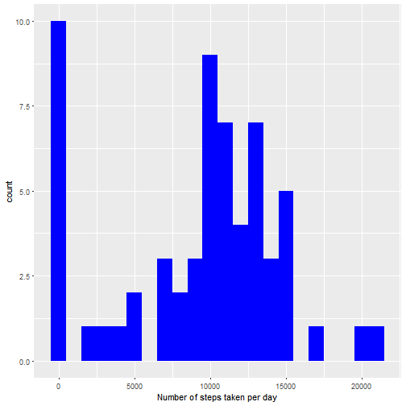
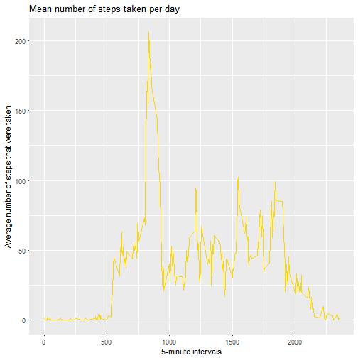
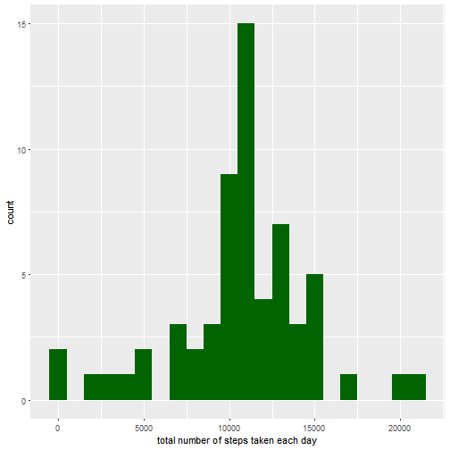
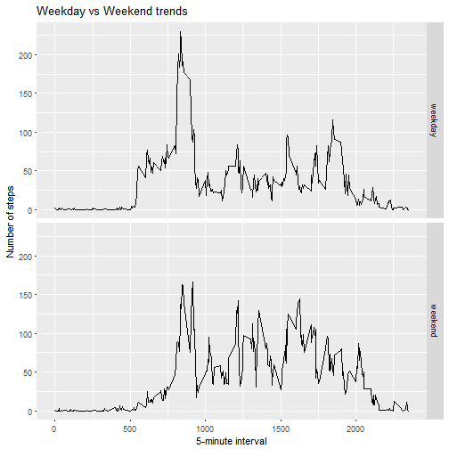

Loading and preprocessing the data before getting the number of steps taken per day. 

```r
# unzip(zipfile="activity.zip") if needed only
data <- read.csv("activity.csv")
#What is mean total number of steps taken per day?
library(ggplot2)
total_steps <- tapply(data$steps, data$date, FUN=sum, na.rm=TRUE)
qplot(total_steps, binwidth=1000, xlab="Number of steps taken per day", fill =I("blue"))
```



```r
mean(total_steps, na.rm=TRUE)
```

```
## [1] 9354.23
```

```r
median(total_steps, na.rm=TRUE)
```

```
## [1] 10395
```

Now here is the description of the pattern:

```r
library(ggplot2)
means <- aggregate(x=list(steps=data$steps), by=list(interval=data$interval),
                   FUN=mean, na.rm=TRUE)
ggplot(data=means, aes(x=interval, y=steps)) +
  geom_line(color= "gold") +
  xlab("5-minute intervals") +
  ylab("Average number of steps that were taken") + 
  ggtitle("Mean number of steps taken per day")
```



On average across all the days in the dataset, which of the 5-minute interval contains the maximum number of steps? And how many missings are there?

```r
MaxSteps <- means[which.max(means$steps),1]
#Imputing missing values
#There are many days/intervals where there are missing values (coded as NA). The presence of missing days may introduce bias into some calculations or summaries of the data.

missing <- is.na(means$steps)
# How many missing
table(missing)
```

```
## missing
## FALSE 
##   288
```

```r
missing1 <- length(missing)
```

So the max value is interval 835. And there are 288 values. 

Next step is to fill missing values using a simple method (the mean).


```r
# Replace each missing value with the mean value of its 5-minute interval
fill.value <- function(steps, interval) {
    filled <- NA
    if (!is.na(steps))
        filled <- c(steps)
    else
        filled <- (means[means$interval==interval, "steps"])
    return(filled)
}
filled.data <- data
filled.data$steps <- mapply(fill.value, filled.data$steps, filled.data$interval)
```


Now, using the filled data set, let's make a histogram of the total number of steps taken each day and calculate the mean and median total number of steps.

```r
total.steps <- tapply(filled.data$steps, filled.data$date, FUN=sum)
qplot(total.steps, binwidth=1000, xlab="total number of steps taken each day", fill =I("darkgreen"))
```



```r
mean(total.steps)
```

```
## [1] 10766.19
```

```r
median(total.steps)
```

```
## [1] 10766.19
```


When adding missing, we get higher values as we input the means for missings. 

The last question is to validate if there are different patterns during the week and over weekends. Let's take a look. 


```r
weekday_weekend <- function(date) {
    day <- weekdays(date)
    if (day %in% c("Monday", "Tuesday", "Wednesday", "Thursday", "Friday"))
        return("weekday")
    else if (day %in% c("Saturday", "Sunday"))
        return("weekend")
    else
        stop("invalid date")
}
filled.data$date <- as.Date(filled.data$date)
filled.data$day <- sapply(filled.data$date, FUN=weekday_weekend)
```
Now, it is time to make the panel plot containing the average number of steps taken on weekdays and weekends.


```r
averages <- aggregate(steps ~ interval + day, data=filled.data, mean)
ggplot(averages, aes(interval, steps)) + geom_line() + facet_grid(day ~ .) +
    xlab("5-minute interval") + ylab("Number of steps") + ggtitle("Weekday vs Weekend trends")
```



So as we can see the patterns differs. 

